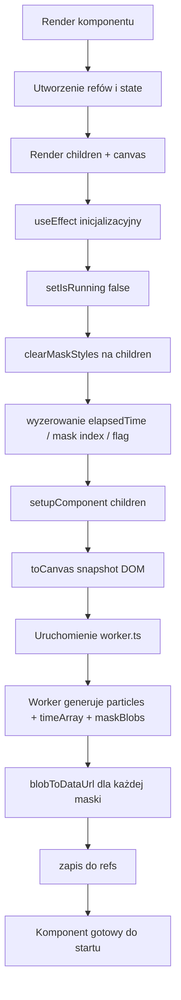
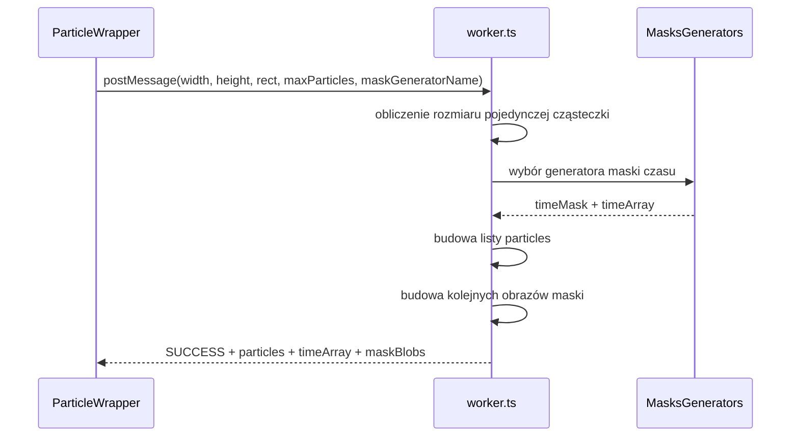
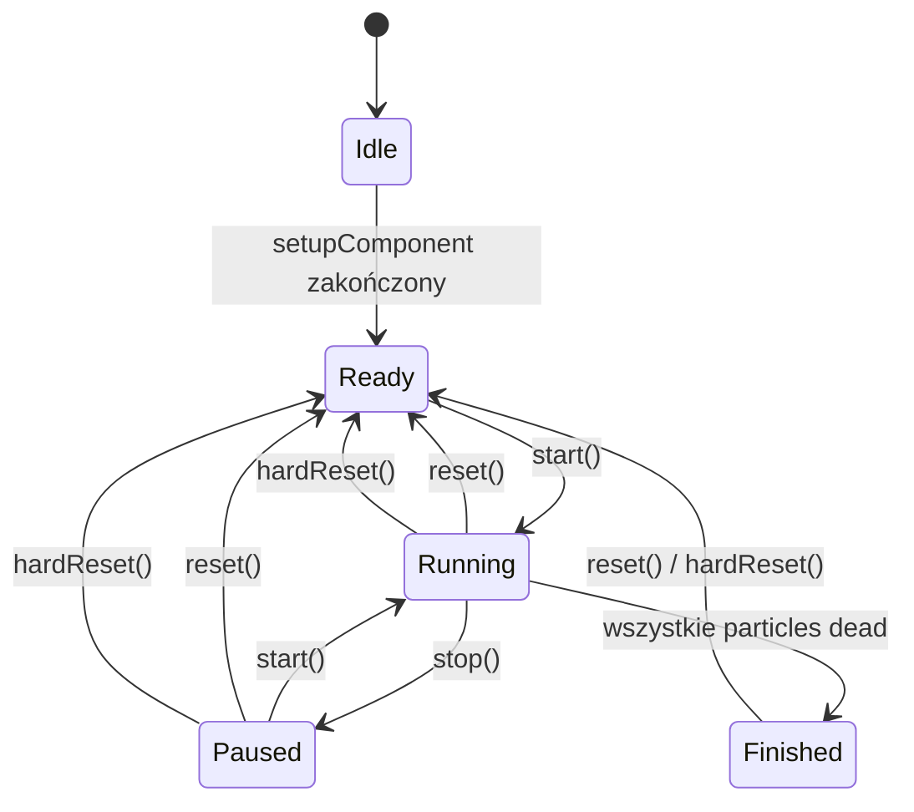
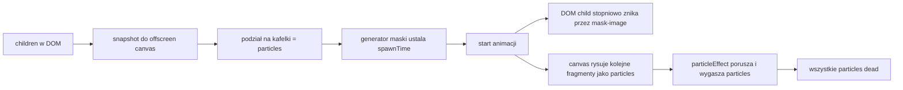

# ParticleWrapper — schemat wykonania i pełny przepływ

Ten dokument opisuje **co dokładnie dzieje się w `ParticleWrapper`**, w jakiej kolejności uruchamiają się hooki, funkcje, worker, maski i efekty cząsteczek.

Opis jest oparty głównie o:
- [src/ParticleWrapper/ParticleWrapper.tsx](../src/ParticleWrapper/ParticleWrapper.tsx)
- [src/ParticleWrapper/worker.ts](../src/ParticleWrapper/worker.ts)
- [src/ParticleWrapper/maskGenerators.ts](../src/ParticleWrapper/maskGenerators.ts)
- [src/ParticleWrapper/particleInitialStates.ts](../src/ParticleWrapper/particleInitialStates.ts)
- [src/ParticleWrapper/particleEffects.ts](../src/ParticleWrapper/particleEffects.ts)
- [src/ParticleWrapper/types.ts](../src/ParticleWrapper/types.ts)

---

## 1. Rola komponentu

`ParticleWrapper` robi 3 rzeczy naraz:

1. renderuje zwykłe `children`,
2. robi snapshot `children` do ukrytego canvasu przez `html-to-image`,
3. rozbija ten snapshot na cząsteczki i animuje je na pełnoekranowym `<canvas>`.

W praktyce efekt wygląda tak:

- oryginalny element jeszcze istnieje w DOM,
- jego widoczność jest stopniowo wycinana przez `mask-image`,
- jednocześnie na canvasie rysowane są cząsteczki z wyciętych fragmentów,
- po czasie wszystkie cząsteczki umierają i animacja się kończy.

---

## 2. Najważniejsze dane w środku komponentu

## `state`

- `windowSize` — rozmiar pełnoekranowego canvasu.
- `isRunning` — czy pętla animacji ma działać.

## `ref`

- `canvasRef` — główny canvas rysujący cząsteczki.
- `childrenRef` — referencja do renderowanego dziecka.
- `offscreenCanvasRef` — snapshot elementu wyrenderowany przez `html-to-image`.
- `elementMaskRef` — lista gotowych masek jako data URL.
- `timeArrayRef` — uporządkowane progi czasowe, kiedy maska ma być zmieniana.
- `workerRef` — aktywny worker generujący dane.
- `workerRequestIdRef` — numer żądania do workera, żeby ignorować stare odpowiedzi.
- `setupSequenceRef` — numer przebiegu `setupComponent`, też do ignorowania starych wyników.
- `particles.current` — pełna lista cząsteczek.
- `animationFrameRef` — identyfikator `requestAnimationFrame`.
- `elapsedTimeRef` — ile sekund minęło od startu animacji.
- `lastMaskIndexRef` — indeks ostatnio użytej maski.
- `shatterFinishedCalledRef` — czy `onShatterFinished` już zostało odpalone.

---

## 3. Konfiguracja wejściowa

Komponent bierze:

- `children`
- `config`
  - `maxParticles`
  - `fps`
- callbacki:
  - `onStart`
  - `onShatterFinished`
  - `onEnd`
  - `onReset`
- klucze wyboru algorytmów:
  - `timeMaskGenerator`
  - `particleInitialState`
  - `particleEffect`

Następnie wybiera konkretne funkcje:

- `resolvedParticleInitialState = ParticleInitialStates[particleInitialState]`
- `resolvedParticleEffect = ParticleEffects[particleEffect]`

To znaczy, że props nie przekazują funkcji bezpośrednio — przekazują **nazwy presetów**.

---

## 4. Główny przepływ życia komponentu



---

## 5. Co dokładnie robi `setupComponent()`

`setupComponent(element)` to najważniejsza funkcja przygotowująca cały efekt.

### Krok po kroku

1. Pobiera `rect` przez `getBoundingClientRect()`.
2. Zwiększa `setupSequenceRef`.
3. Robi snapshot elementu przez `toCanvas(element, ...)`.
4. Zapisuje wynik do `offscreenCanvasRef.current`.
5. Czyści stare maski z pamięci.
6. Zwiększa `workerRequestIdRef`.
7. Zabija poprzedniego workera, jeśli istniał.
8. Tworzy nowego workera z `worker.ts`.
9. Wysyła do workera:
   - `width`, `height`
   - `rectX`, `rectY`
   - `maxParticles`
   - `maskGeneratorName`
   - `particleInitialStateName` *(uwaga: obecnie worker tego realnie nie używa)*
10. Czeka na odpowiedź `SUCCESS`.
11. Jeśli w międzyczasie pojawił się nowszy setup albo nowszy request, wynik jest ignorowany.
12. Zapisuje:
   - `timeArrayRef.current`
   - `particles.current`
   - `elementMaskRef.current`

### Co finalnie daje `setupComponent()`

Po tej funkcji komponent ma gotowe:

- obraz źródłowy elementu,
- listę cząsteczek,
- harmonogram pojawiania się cząsteczek (`spawnTime`),
- gotowe kolejne maski do nakładania na DOM element.

---

## 6. Co robi `worker.ts`

Worker wykonuje cięższą część obliczeń poza głównym wątkiem.



### W środku workera

1. Dobierany jest generator maski z `MasksGenerators[maskGeneratorName]`.
2. Na podstawie `width * height` oraz `maxParticles` wylicza się przybliżony rozmiar jednej cząsteczki:
   - `pixelWidth`
   - `pixelHeight`
3. Element dzielony jest na siatkę `cols x rows`.
4. Generator maski zwraca:
   - `mask[x][y]` — kiedy dany fragment ma „odpadać”,
   - `timeArray` — wszystkie unikalne czasy w kolejności.
5. Dla każdego kafelka tworzony jest `Particle` z:
   - pozycją początkową,
   - rozmiarem,
   - zerowymi prędkościami,
   - `spawnTime` z maski czasu,
   - sprite source (`sourceX`, `sourceY`) do wycinania fragmentu z obrazka.
6. Worker generuje serię bitmap masek:
   - start: całość czarna = element w pełni widoczny,
   - potem dla każdego czasu `t` czyści piksele, których `timeMask <= t`,
   - po każdym kroku eksportuje PNG jako `Blob`.
7. Na koniec wysyła wynik do komponentu.

---

## 7. Start animacji — co dzieje się po `start()`

Metoda wystawiona przez `ref`:

- odpala `onStart()`,
- ustawia `isRunning = true`.

To uruchamia `useEffect` odpowiedzialny za pętlę animacji.

```mermaid
flowchart TD
    A[start()] --> B[onStart]
    B --> C[setIsRunning true]
    C --> D[useEffect animacji]
    D --> E[requestAnimationFrame]
    E --> F[aktualizacja elapsedTime]
    F --> G[aktualizacja maski children]
    G --> H[aktualizacja particles]
    H --> I[drawParticles]
    I --> J{czy wszystkie dead?}
    J -- nie --> E
    J -- tak --> K[onEnd i stop pętli]
```

---

## 8. Co robi każda klatka animacji

Funkcja `frame(currentTime)` w pętli animacji robi dokładnie to:

### 8.1. Sterowanie czasem

- pierwsza klatka ustawia `lastFrameTime`,
- liczy `frameDeltaTime`,
- dodaje ten czas do `elapsedTimeRef.current`,
- stosuje limit FPS przez `interval = 1000 / config.fps`.

### 8.2. Aktualizacja maski DOM elementu

Jeśli istnieją `childrenRef` i `timeArrayRef`:

1. sprawdzany jest aktualny `elapsedTime`,
2. `lastMaskIndexRef` przesuwa się tak długo, aż dogoni wszystkie progi czasu z `timeArray`,
3. po zmianie indeksu nakładana jest **poprzednia** maska, nie aktualna,
4. po przejściu całego `timeArray` jest sztucznie dodany jeszcze jeden końcowy krok po `+0.05s`,
5. gdy wszystko się rozsypało, odpala się `onShatterFinished()` tylko raz.

### Dlaczego maska jest „o 1 krok do tyłu”

Kod specjalnie nakłada `elementMaskRef[lastMaskIndexRef - 2]`.

To oznacza:

- cząsteczki już startują,
- ale oryginalny element znika minimalnie później,
- dzięki temu przejście wygląda mniej agresywnie.

### 8.3. Aktualizacja pozycji cząsteczek

Dla każdej cząsteczki:

1. jeśli jej `spawnTime` jeszcze nie nadszedł:
   - pozycja jest przypinana do aktualnego `childrenRef.getBoundingClientRect()`,
   - czyli nieruszone fragmenty próbują śledzić aktualne położenie elementu,
2. jeśli cząsteczka już jest martwa, jest pomijana,
3. jeśli `elapsedTime >= spawnTime`, wywoływany jest `resolvedParticleEffect(p, deltaSeconds)`.

### 8.4. Koniec animacji

Jeśli wszystkie cząsteczki są `isDead = true`:

- pętla ustawia lokalne `running = false`,
- wywołuje `onEnd()`,
- przestaje renderować kolejne klatki.

---

## 9. Co robi `drawParticles()`

`drawParticles(elapsedTime)`:

1. czyści główny canvas,
2. iteruje po `particles.current`,
3. pomija cząsteczki martwe,
4. pomija cząsteczki, których `spawnTime` jeszcze nie nadszedł,
5. ustawia `ctx.globalAlpha = particleStyle.opacity`,
6. rysuje z `offscreenCanvasRef` odpowiedni fragment przez `drawImage(...)`.

To ważne: każda cząsteczka nie ma osobnego obrazka. Ona tylko wskazuje:

- który prostokąt z oryginalnego snapshotu wziąć,
- gdzie narysować go na pełnoekranowym canvasie.

---

## 10. Co wywołuje ponowną inicjalizację

W komponencie jest efekt:

- zatrzymuje animację,
- czyści maskę z elementu,
- resetuje zegary,
- woła `setupComponent(childrenRef.current)`.

Ten efekt zależy od:

- `setupComponent`
- `clearMaskStyles`

A `setupComponent` zmienia się, gdy zmieni się któreś z:

- `config.maxParticles`
- `timeMaskGenerator`
- `particleInitialState`

### Czyli realnie pełny re-setup następuje po zmianie:

- `maxParticles`
- `timeMaskGenerator`
- `particleInitialState`

### Nie powodują automatycznie pełnego re-setupu:

- `particleEffect`
- `config.fps`
- samo `children`

To bardzo ważne.

---

## 11. Co dzieje się przy zmianie poszczególnych propsów

## `timeMaskGenerator`

Dzieje się:

1. `setupComponent` dostaje nową zależność,
2. efekt inicjalizacyjny uruchamia się ponownie,
3. animacja jest zatrzymywana,
4. maska znika,
5. tworzony jest nowy snapshot,
6. worker liczy nowy `timeMask` i nowy `timeArray`,
7. cząsteczki dostają nowe `spawnTime`.

### Efekt końcowy

Zmienia się **kolejność rozpadu** elementu.

---

## `particleInitialState`

Dzieje się:

1. `resolvedParticleInitialState` wskazuje nową funkcję,
2. `setupComponent` uruchamia się ponownie,
3. generowany jest nowy zestaw cząsteczek.

### Ważny szczegół

W aktualnym kodzie `resolvedParticleInitialState(p)` jest wołane tylko w `resetParticles()`.

To oznacza, że:

- **przy pierwszym setupie initial state nie jest aplikowany do nowych cząsteczek**,
- worker tworzy cząsteczki z zerowymi prędkościami,
- więc preset startowy zaczyna mieć znaczenie dopiero po `reset()`.

To wygląda jak **niedokończona integracja** albo bug projektowy.

---

## `particleEffect`

Nie ma pełnego re-setupu.

Dzieje się:

1. `resolvedParticleEffect` zmienia się na inną funkcję,
2. `useEffect` od pętli animacji ma tę funkcję w dependency array,
3. jeśli animacja działa, stary loop się czyści i uruchamia się nowy.

### Efekt końcowy

Zmienia się sposób poruszania i umierania cząsteczek, ale:

- same cząsteczki,
- snapshot,
- maski,
- `spawnTime`

pozostają te same.

---

## `config.maxParticles`

Dzieje się pełny re-setup.

Skutek:

- zmienia się gęstość siatki,
- zmienia się liczba cząsteczek,
- zmienia się rozmiar pojedynczego kawałka,
- generowane są nowe maski dla nowej siatki.

---

## `config.fps`

Nie ma pełnego re-setupu.

Dzieje się:

- restartuje się tylko efekt z pętlą animacji,
- zmienia się częstotliwość aktualizacji klatek.

Same dane cząsteczek nie są generowane od nowa.

---

## `children`

### W praktyce teraz

Sama zmiana `children` **nie jest gwarantowanym triggerem** do `setupComponent()`.

Autor dodał komentarz przy `hardReset()`, że jest przydatny, gdy dzieci się zmieniają. To sugeruje, że:

- komponent **nie obsługuje w pełni automatycznego odświeżenia snapshotu przy zmianie treści children**,
- po zmianie wyglądu childa trzeba ręcznie wywołać `hardReset()`.

---

## 12. Metody wystawione przez `ref`



## `start()`

- odpala `onStart()`,
- ustawia `isRunning = true`.

## `stop()`

- ustawia `isRunning = false`,
- nie czyści cząsteczek,
- nie resetuje czasu,
- nie przywraca maski.

Czyli to jest bardziej **pauza** niż pełny stop.

Po ponownym `start()` animacja leci dalej od aktualnego stanu, bo:

- `elapsedTimeRef` zostaje,
- `lastMaskIndexRef` zostaje,
- pozycje cząsteczek zostają.

## `reset()`

Robi pełny logiczny reset stanu animacji, ale bez nowego snapshotu.

Kolejność:

1. `setIsRunning(false)`
2. `clearMaskStyles(children)`
3. `resetParticles()`
4. `onReset()`

### `resetParticles()` robi:

- czyści canvas,
- zeruje `elapsedTimeRef`,
- zeruje `lastMaskIndexRef`,
- zeruje `shatterFinishedCalledRef`,
- ustawia każdej cząsteczce pozycję na origin,
- zeruje velocity i acceleration,
- ustawia `isDead = false`,
- zeruje `age`,
- ustawia `opacity = 1`,
- wywołuje `resolvedParticleInitialState(p)`.

To jest **jedyny moment**, kiedy preset `particleInitialState` jest realnie przykładany do każdej cząsteczki.

## `hardReset()`

Kolejność:

1. `setIsRunning(false)`
2. `clearMaskStyles(children)`
3. `setupComponent(element)`
4. `onReset()`

To odświeża:

- snapshot elementu,
- maski,
- particles.

Ale nie wywołuje `resetParticles()`.

---

## 13. Resize okna

Przy `resize`:

1. aktualizuje się `windowSize`,
2. canvas dostaje nowy `width` i `height`.

### Co się nie dzieje automatycznie

- nie ma pełnego `setupComponent()`,
- snapshot childa nie jest automatycznie liczony od nowa,
- particles nie są odtwarzane od nowa,
- rect childa nie jest od razu przebudowywany globalnie.

Jest tylko częściowe dostosowanie, bo cząsteczki przed swoim `spawnTime` próbują śledzić bieżący `getBoundingClientRect()`.

---

## 14. Callbacki i moment ich odpalenia

## `onStart`

Odpalany natychmiast w `start()`.

## `onShatterFinished`

Odpalany raz, gdy:

- maska przeszła już cały harmonogram,
- `lastMaskIndexRef.current > timeArrayRef.current.length`.

To znaczy:

- oryginalny DOM element został już praktycznie cały „wycięty”,
- ale część cząsteczek może jeszcze lecieć.

## `onEnd`

Odpalany, gdy wszystkie cząsteczki są `dead`.

To jest późniejszy moment niż `onShatterFinished`.

## `onReset`

Odpalany po `reset()` i po `hardReset()`.

---

## 15. Presety generatorów maski — co zmieniają

Te presety **nie zmieniają fizyki cząsteczek**. One zmieniają tylko `spawnTime` i kolejność wycinania oryginalnego elementu.

## Kierunkowe

- `leftToRight` — rozpad od lewej do prawej.
- `rightToLeft` — od prawej do lewej.
- `topToBottom` — od góry do dołu.
- `bottomToTop` — od dołu do góry.

## Po przekątnych

- `topLeftDiagonal`
- `topRightDiagonal`
- `bottomLeftDiagonal`
- `bottomRightDiagonal`

## Specjalne

- `sand` — rozpad blokami od dołu, zygzakiem lewo/prawo.
- `centerOut` — od środka na zewnątrz.
- `edgesIn` — od krawędzi do środka.
- `splitHorizontal` — od środka poziomo na boki.
- `splitVertical` — od środka pionowo góra/dół.
- `random` — losowe grupy czasu.

---

## 16. Presety `particleInitialState` — co ustawiają

Te presety ustawiają głównie **początkowe velocity**.

- `explosion` — losowy kierunek na zewnątrz.
- `scatter` — rozrzut głównie do góry i na boki.
- `freefall` — prawie brak startowej prędkości.
- `fountain` — wystrzał do góry.
- `implosion` — ruch „do środka” względem wylosowanego kierunku.
- `vortex` — prędkość styczna do ruchu obrotowego.
- `raindrop` — ruch w dół.
- `drift` — lekki losowy dryf.

Jeszcze raz: w obecnym kodzie te presety są realnie nakładane dopiero przy `resetParticles()`.

---

## 17. Presety `particleEffect` — co robi każda klatka

Te presety wykonują się dla każdej aktywnej cząsteczki w każdej klatce po `spawnTime`.

## Proste pionowe ruchy

- `blowDown`
  - ustawia `velocityY = +speed`,
  - przesuwa w dół,
  - wygasza `opacity`.

- `blowUp`
  - ustawia `velocityY = -speed`,
  - przesuwa w górę,
  - wygasza `opacity`.

## Z grawitacją

- `gravitationBottom`
  - zwiększa `velocityY` o `gravity * deltaTime`,
  - więc przyspiesza w dół.

- `gravitationUp`
  - zmniejsza `velocityY` o `gravity * deltaTime`,
  - więc przyspiesza w górę.

- `windyGravity`
  - dodaje wiatr w X i grawitację w Y.

## Ruchy niestandardowe

- `wavyFloating`
  - miało robić falowanie po `sin(age * frequency)`,
  - plus delikatny ruch w górę,
  - ale `particleLife.age` nie jest nigdzie inkrementowane,
  - więc część „wavy” praktycznie nie działa.

- `flickerFade`
  - zostawia aktualny ruch velocity,
  - losowo przyciemnia opacity bardziej niż standardowy fade.

- `swirl`
  - obraca wektor prędkości o mały kąt,
  - lekko wzmacnia prędkość.

- `shrinkFade`
  - nie zmienia rozmiaru realnie,
  - tylko szybciej zmniejsza `opacity`.

### Wspólna cecha prawie wszystkich efektów

Każdy z nich zwykle robi:

1. modyfikację velocity,
2. aktualizację `x` i `y`,
3. zmniejszenie `opacity`,
4. ustawienie `isDead`, gdy `opacity <= 0`.

---

## 18. Rzeczy, które warto zauważyć w aktualnej implementacji

## 1. `particleInitialState` nie działa przy pierwszym starcie

Nowe cząsteczki po `setupComponent()` mają zero velocity. Preset początkowy jest nakładany dopiero po `reset()`.

## 2. `particleLife.age` nie jest aktualizowane

Pole istnieje, ale w pętli animacji nie ma czegoś w stylu:

- `p.particleLife.age += deltaSeconds`

Przez to efekty zależne od wieku nie dostają prawdziwego czasu życia.

## 3. `stop()` to pauza, nie reset

Po `start()` animacja rusza dalej z tego samego miejsca.

## 4. Zmiana `children` nie wymusza automatycznie nowego snapshotu

Do bezpiecznego odtworzenia danych trzeba użyć `hardReset()`.

## 5. `onShatterFinished` i `onEnd` to dwa różne momenty

- `onShatterFinished` — kończy się znikanie oryginalnego DOM elementu,
- `onEnd` — kończy się życie wszystkich cząsteczek.

---

## 19. Najkrótszy mental model

Jeśli chcesz myśleć o tym komponencie bardzo prosto, to działa tak:



---

## 20. Co dzieje się przy konkretnych akcjach użytkownika

## Akcja: komponent się mountuje

- renderuje child i canvas,
- czyści maskę,
- robi snapshot,
- worker generuje particles i maski,
- komponent czeka na `start()`.

## Akcja: `start()`

- odpala `onStart`,
- rusza pętla `requestAnimationFrame`,
- maska zaczyna wycinać DOM,
- particles zaczynają być aktywowane po swoich `spawnTime`.

## Akcja: `stop()`

- pętla się zatrzymuje,
- stan animacji zostaje zachowany.

## Akcja: `start()` po `stop()`

- animacja kontynuuje od miejsca zatrzymania.

## Akcja: `reset()`

- zatrzymuje animację,
- przywraca widoczność childa,
- resetuje wszystkie particles,
- nakłada `particleInitialState` od nowa.

## Akcja: `hardReset()`

- zatrzymuje animację,
- przywraca child,
- robi nowy snapshot,
- tworzy od nowa particles i maski.

## Akcja: zmiana `particleEffect`

- zmienia się tylko logika ruchu/fade w kolejnych klatkach.

## Akcja: zmiana `timeMaskGenerator`

- przeliczany jest cały harmonogram znikania i spawnów.

## Akcja: zmiana `maxParticles`

- zmienia się podział elementu na kawałki.

## Akcja: zmiana `fps`

- zmienia się tempo odświeżania pętli.

---

## 21. Podsumowanie w jednym zdaniu

`ParticleWrapper` najpierw zamienia `children` w obraz, potem tnie ten obraz na kafelki, przypisuje każdemu kafelkowi moment odpadnięcia przez maskę czasu, a podczas animacji równolegle ukrywa oryginalny element w DOM i rysuje jego fragmenty jako cząsteczki na canvasie.
